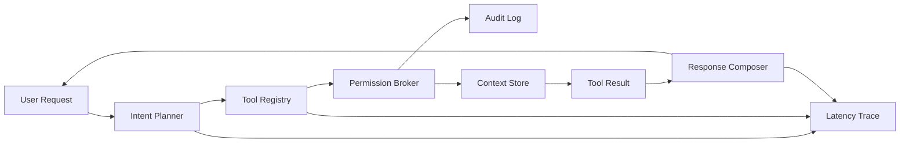

# Aegis Runtime

Aegis Runtime is a live, local-first assistant runtime demo aimed at the Siri Runtime Platform role: personal context understanding, simulated screen awareness, permissioned tool execution, auditability, and low-latency runtime profiling.

This is intentionally more than a chatbot. The runtime separates intent planning, context retrieval, tool execution, privacy checks, audit logging, and response composition so reviewers can inspect the platform architecture.

## What it demonstrates

- On-device-style assistant runtime foundation
- Personal context retrieval with SQLite FTS
- Simulated screen awareness adapter
- Permission-scoped tool execution
- Privacy audit log for every tool call
- Latency profiling for planning, tool execution, and response composition
- Testable runtime contracts
- Hugging Face Spaces-ready web UI

## Run locally

```bash
cd aegis-runtime
python -m venv .venv
source .venv/bin/activate
pip install -r requirements.txt
python app.py
```

## Test

```bash
cd aegis-runtime
PYTHONPATH=. pytest -q
```

## Demo prompts

- What did I discuss with Priya about the launch?
- Summarize what is on my screen
- Open the Aegis runtime spec document
- Remind me to reply to Alex after my meeting
- Summarize my runtime architecture notes from yesterday

## Architecture



## Hugging Face deployment

This folder is already structured like a Gradio Space. Create a Hugging Face Space with:

- SDK: Gradio-compatible Python app
- App file: `app.py`
- Python requirements: `requirements.txt`

Then push the contents of this directory to the Space repository. The app serves a FastAPI UI on port `7860`, which keeps the deployment path small and reliable.

## Roadmap

- Add MLX/Core ML local embedding adapter for Apple Silicon
- Add Swift/C++ runtime shim for Apple-platform credibility
- Add active-window capture on macOS using Accessibility APIs
- Add streaming response transport and cancellation
- Add Instruments screenshots and benchmark reports

## Video walkthrough outline

1. Open the live app and state the goal: a local-first runtime foundation for personal assistant experiences.
2. Run `What did I discuss with Priya about the launch?` and point out private context retrieval.
3. Run `Summarize what is on my screen` and point out the screen-awareness adapter.
4. Run `Remind me to reply to Alex after my meeting` and point out tool execution plus permission audit.
5. Show the latency profile and explain how each request is timed end to end.
6. Open the code briefly: planner, tool registry, permission broker, SQLite context store, tests.
